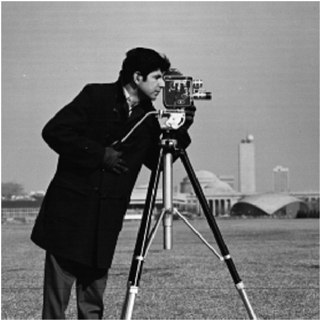

# Compressive Imaging in Shift-Invariant Spaces

### [Paper](https://arxiv.org/abs/2106.00404)

[Tin Vlašić](https://www.fer.unizg.hr/en/tin.vlasic), [Damir Seršić](https://www.fer.unizg.hr/en/damir.sersic) <br>
Faculty of Electrical Engineering and Computing, University of Zagreb, Croatia

This is the official implementation of the paper "Single-Pixel Compressive Imaging in Shift-Invariant Spaces via Exact Wavelet Frames."

## 1. Introduction
The paper proposes a continuous-domain approach to addressing the single-pixel compressive imaging problem. It uses the theory of generalized sampling in shift-invariant spaces to discretize the acquisition procedure of the single-pixel camera in an exact way. Such an approach allows us to model the observed two-dimensional signal in a more appropriate continuous-domain shift-invariant subspace than in the standard pixel-by-pixel subspace which we show that is too coarse an approximation. In the paper, the proposed method is implemented by using B-spline basis functions which then model the underlying continuous-domain representation of the image. To induce sparsity, which is necessary to achieve a faithful reconstruction in compressive imaging, we use biorthogonal spline wavelets that complement the B-spline signal generators. The experimental results have shown that the proposed framework significantly overachieves the conventional approach in single-pixel compressive imaging.

In the table below, we give a comparison between the conventional and our approach for reconstructions of the _cameraman_ image from the same 25% of compressive imaging measurements. The biorthogonal wavelets _bior2.2_ were used as a sparsity inducing domain.

| Ground truth | Standard "pixel-by-pixel" function space | B<sub>3</sub>-spline function space |
| :---: | :---: | :---: | 
|  |  |  |
| PSNR: ∞, SSIM: 1 | PSNR: 30.03 dB, SSIM: 0.7967 | PSNR: 38.17 dB, SSIM: 0.9452 | 

## 2. Setup
### mfIPM solver
This software package uses an external package of the Matrix-free IPM (mfIPM) solver for the compressive sensing minimization problem. The solver's source code and additional scripts can be found [here](https://www.maths.ed.ac.uk/ERGO/mfipmcs/). For convenience, we provide the solver's source code in the _mfIPM_ subdirectory.

To setup the mfIPM solver, start MATLAB and set the working directory to the main directory of the mfIPM package (...\compressive_imaging_in_si_spaces\mfIPM\mfipmCode). At the MATLAB prompt, run
```
>> setupmfipm
```
This script adds the appropriate directories in the MATLAB path. The script will try to permanently add these directories to your path (in pathdefs.m), but may fail if that file is read-only. In that case, please copy and paste to your startup.m file the 'addpath' commands printed to the screen. If that does not help, please read the README.txt file provided in the _mfipmCode_ subdirectory.

To test if the setup for the mfIPM has been completed successfully, please run in the MATLAB prompt:
```
>> mfipm_demo
```
### Fast WHT
If the mfIPM solver has been successfully installed, please set the working directory to the main directory of the software package (...\compressive_imaging_in_si_spaces). To use a fast realization of the Walsh-Hadamard transform (WHT), build a C program fastWht.c into a MEX file by running in the MATLAB prompt
```
>> mex fastWht.c
```
If there are problems with building the fastWht.c program, please refer to the MathWorks [documentation](https://ch.mathworks.com/help/matlab/ref/mex.html) on buliding a MEX function.

The fast WHT can be tested with a simple example code:
```
x = rand(1, 16);
y = fastWht(x);
xHat = fastWht(y); % the transform should reproduce x
```

### MATLAB toolboxes
The software package uses MATLAB signal processing and wavelet toolboxes. Instructions on installing a MATLAB toolbox can be found [here](https://www.mathworks.com/products/matlab/add-on-explorer.html).

We are set!

## 3. Quick Start
Set the working directory to the main directory of the software package (...\compressive_imaging_in_si_spaces). By running in the MATLAB prompt
```
>> CompImaging_mfIPM
```
the software should print information on the default settings and parameters, and the mfIPM solver will start minimazing the loss function. Once the optimization problem is solved, the software should output some solver details and two images, the left one corresponds to the _cameraman_ ground truth and the second one to the reconstructed image from 25% of the measurements. Finally, the software outputs reconstruction results in terms of the PSNR and SSIM. The results should correspond to the results published in Figure 8d of the manuscript.

To try other parameters, input images, wavelet spasity bases, measurement patterns and underlying signal models, open the CompImaging_mfIPM.m script and change parameters in the _Definition and initialization of variables_ section.

## 4. Add-Ons
### Standard test images
Standard test images of 512 x 512 size that were used in the numerical experiments can be found in the [_standard_test_images_](./standard_test_images/) subdirectory.

### Reconstruction results and the λ parameter
In the [_results_lambda_wht_tol-8-2_](./results_lambda_wht_tol-8-2/) subdirectory, there are reconstruction results in .mat files that correspond to various sparsity inducing biorthogonal wavelets. The reconstruction results are given in the terms of the PSNR and SSIM. These results correspond to the results for the _bior2.2_ and _bior4.4_ wavelets given by the bar charts in Figures 4, 5, 6 and 7 of the paper. Additionally, the provided .mat files store optimal values of the regularization parameter λ, which were determined experimentally for every setting such that they lead to the best reconstruction results in terms of the PSNR.

The results and λ values are stored in matrices in structures. Matrices are of 4 x 10 dimensions, where the rows correspond to the orders of the B-spline subspace of the underlying signal model, and columns to the measurement ratios which are in the paper set from 0.05 to 0.5. An example of the reconstruction results in the term of the PSNR for the _cameraman_ image and the _bior2.2_ wavelet sparsity basis:

| p \ m<sub>r</sub> | 0.05 | 0.10 | 0.15 | 0.20 | 0.25 | 0.30 | 0.35 | 0.40 | 0.45 | 0.50 |
| --- | --- | --- | --- | --- | --- | --- | --- | --- | --- | --- |
| **0** | `22.47` | `24.99` | `27.34` | `28.76` | `30.35` | `31.50` | `32.95` | `34.15` | `35.27` | `35.88` |
| **1** | `24.04` | `27.94` | `30.25` |	`32.29` | `33.82` |	`35.13` | `36.26` |	`37.72` | `38.55` |	`39.31` |
| **2** | `24.97` |	`28.94` | `31.71` | `33.74` | `35.65` |	`37.17` | `38.61` |	`39.76` | `41.20` |	`41.73` |
| **3** | `25.49` |	`30.46` | `33.99` |	`36.79` | `39.22` |	`40.64` | `42.90` |	`44.16` | `45.21` |	`46.37` |

## 5. License
```
Compressive Imaging in Shift-Invariant Spaces
Copyright (C) 2022,  Tin Vlasic and Damir Sersic

This program is free software: you can redistribute it and/or modify
it under the terms of the GNU General Public License as published by
the Free Software Foundation, either version 3 of the License, or
(at your option) any later version.

This program is distributed in the hope that it will be useful,
but WITHOUT ANY WARRANTY; without even the implied warranty of
MERCHANTABILITY or FITNESS FOR A PARTICULAR PURPOSE.  See the
GNU General Public License for more details.

You should have received a copy of the GNU General Public License
along with this program. If not, see <https://www.gnu.org/licenses/>.
```

## 6. Citation
If you find our work useful in your research, please cite:
```
@article{vlasic2022,
    title = {Single-pixel compressive imaging in shift-invariant spaces via exact wavelet frames},
    journal = {Signal Processing: Image Communication},
    volume = {105},
    pages = {116702},
    year = {2022},
    doi = {https://doi.org/10.1016/j.image.2022.116702},
    url = {https://www.sciencedirect.com/science/article/pii/S0923596522000443},
    author = {Tin Vlašić and Damir Seršić}
}
```

## 7. Contact
If you have any questions, please feel free to email the authors.
